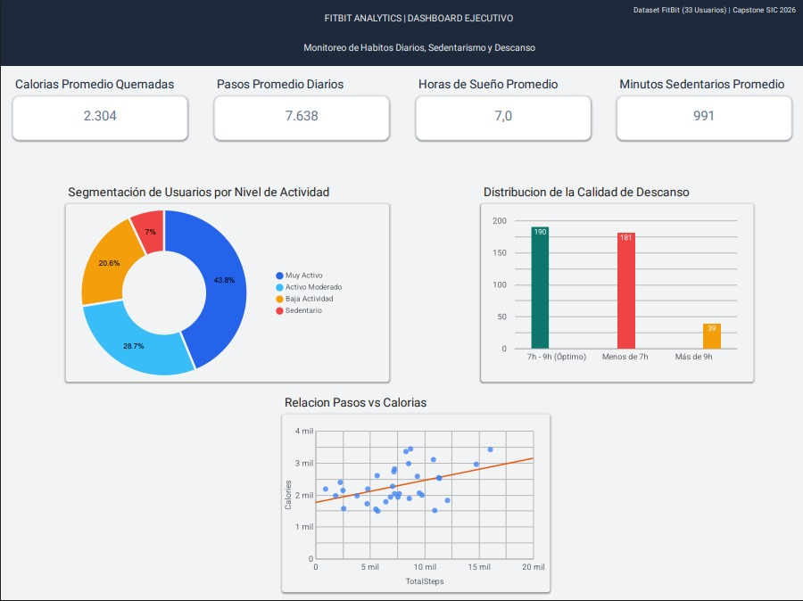
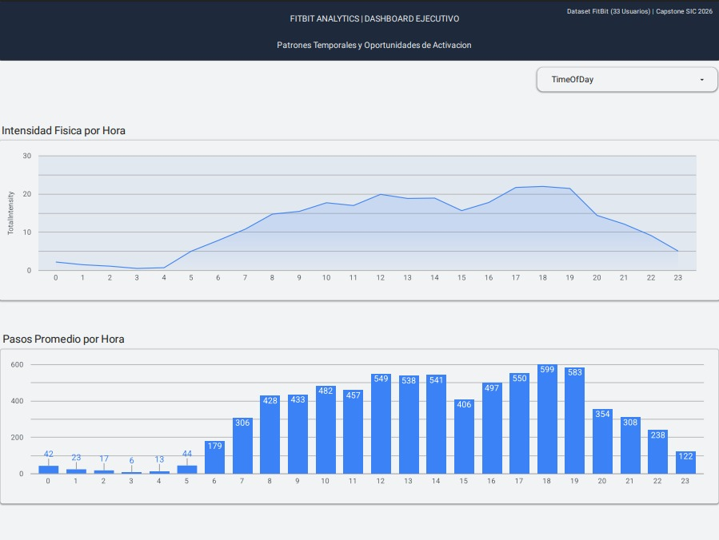

# 📊 FitBit Capstone Project
**Samsung Innovation Campus — Especialización en Big Data 2026**

---

## 📌 1. Contexto y Objetivos del Proyecto
Este proyecto implementa una solución integral de Big Data de extremo a extremo para analizar patrones biométricos y hábitos diarios de usuarios de tecnología vestible (*smart devices*). Utilizando el conjunto de datos público de FitBit (33 participantes monitoreados durante un mes), el objetivo principal es extraer *insights* estratégicos para **Bellabeat**, orientados a optimizar sus productos de salud femenina y campañas de *engagement*.

### Preguntas Guía de Negocio:
1. **Distribución del tiempo diario:** ¿Cómo se reparte la jornada activa frente al sedentarismo?
2. **Higiene del sueño:** ¿Qué proporción de usuarios alcanza el rango recomendado de 7 a 9 horas de descanso?
3. **Gasto calórico:** ¿Existe una relación directa y lineal entre el volumen de pasos y las calorías quemadas?
4. **Picos de intensidad:** ¿En qué ventanas horarias se concentran los mayores esfuerzos físicos?
5. **Comportamiento por hora:** ¿Coincide el volumen de pasos promedio con las franjas de mayor intensidad?

### Fuente de Datos
* **Dataset:** [FitBit Fitness Tracker Data (Kaggle)](https://www.kaggle.com/datasets/arashnic/fitbit)
* **Autor:** Arash Nic
* **Licencia:** CC0: Public Domain

---

## 🏗️ 2. Arquitectura de la Solución

```text
Archivos CSV Brutos (data/raw)
       │
       ▼
Apache Spark (PySpark ETL) ──► Limpieza, deduplicación, tipado y joins
       │
       ▼
Almacenamiento Parquet (data/processed)
       │
       ▼
Google Cloud BigQuery (US Multi-Region) ──► Tablas limpias + Vistas SQL modeladas
       │
       ▼
Looker Studio Dashboard ──► Visualizaciones ejecutivas interactivas
```

### Tecnologías Utilizadas:
* **Entorno y Control de Versiones:** Visual Studio Code, Git, GitHub.
* **Procesamiento Distribuido (ETL):** Apache Spark (PySpark), Python (Pandas, PyArrow).
* **Data Warehouse en la Nube:** Google Cloud Platform (BigQuery).
* **Modelado Analítico:** SQL (Vistas agregadas).
* **Business Intelligence:** Google Looker Studio.

---

## 📂 3. Estructura del Repositorio

```text
Fitbit/
├── data/
│   ├── raw/                  <- CSVs originales de FitBit
│   └── processed/            <- Archivos limpios en formato Parquet
├── images/
│   ├── imagesdashboard_preview1.png <- Captura de pantalla de dashboard pagina 1
│   └── imagesdashboard_preview2.png <- Captura de pantalla de dashboard pagina 2
├── notebooks/
│   └── miniproyecto_analisis.ipynb  <- Análisis exploratorio y gráficos
├── sql/
│   ├── 01_views_daily.sql    <- Vista modelada de KPIs diarios y descanso
│   └── 02_views_hourly.sql   <- Vista horaria agrupada por franjas
├── src/
│   ├── etl_pipeline.py       <- Pipeline ETL automatizado en PySpark
│   └── bigquery_loader.py    <- Carga hacia GCP BigQuery
├── credentials.json          <- Clave de cuenta de servicio (en .gitignore)
├── .gitignore                <- Exclusión de datos pesados y credenciales
├── requirements.txt          <- Dependencias del entorno Python
└── README.md                 <- Documentación técnica y de negocio
```

---

## ⚙️ 4. Ejecución del Pipeline

### 1. Clonar el repositorio e instalar dependencias:
```
git clone [https://github.com/Kemtojp/fitbit.git](https://github.com/Kemtojp/fitbit.git)
cd fitbit
pip install -r requirements.txt
```

### 2. Ejecutar el Pipeline ETL con Spark:
Limpia los datos, estandariza formatos temporales, genera métricas de negocio y exporta los datasets optimizados a data/processed/*.parquet
```
python src/etl_pipeline.py
```
### 3. Cargar datos limpios a BigQuery:
Asegúrate de colocar tu clave credentials.json en la raíz
```
python src/bigquery_loader.py
```
---

## 📈 5. Visualización de Resultados (Looker Studio)

El informe ejecutivo interactivo fue desarrollado en **Looker Studio**, consumiendo directamente las vistas `view_daily_kpis` y `view_hourly_trends` alojadas en BigQuery.

🔗 **[Abrir Dashboard Interactivo en Looker Studio](https://datastudio.google.com/s/pkhqHUXnsJw)**

### Captura del Dashboard:



---

## 💡 6. Conclusiones y Hallazgos Principales

* **Distribución de actividad y sedentarismo:** Aunque el 43.8% de las jornadas evaluadas alcanzan la meta de "Muy Activo" ($\ge$10.000 pasos), el tiempo sedentario promedio sigue siendo dominante, alcanzando 991 minutos diarios (más del 80% de las horas despierto).
* **Déficit de descanso:** Cerca del 44% de las noches analizadas registran menos de 7 horas de sueño, situando el promedio por debajo del estándar médico recomendado.
* **Relación Pasos vs. Calorías:** Existe una correlación lineal positiva directa: mantener promedios superiores a 10.000 pasos asegura superar la barrera de 2.500 calorías de gasto diario.
* **Patrones temporales definidos:** Los picos de mayor esfuerzo ocurren en dos franjas marcadas: entre las 12:00 y 14:00 hrs y su punto máximo entre las 17:00 y 19:00 hrs (alcanzando su pico máximo a las 18:00 hrs con 599 pasos promedio).

---

## 🎯 7. Recomendaciones Estratégicas para Bellabeat

1. **Notificaciones Push anti-sedentarismo (14:30 hrs):** Alertar a las usuarias antes del valle de actividad de media tarde con metas cortas de caminata (250 pasos).
2. **Alertas predictivas de higiene de sueño:** Enviar avisos 45 minutos antes de acostarse recomendando desconexión de pantallas para mitigar el déficit crónico de descanso.
3. **Desafíos comunitarios a las 18:00 hrs:** Programar eventos guiados y retos grupales en la aplicación aprovechando el momento natural de mayor movilidad.

---

## 👤 Autor
* **Juan Velasquez** — Desarrollo integral de extremo a extremo (Ingesta, ETL en Apache Spark, Data Warehouse en BigQuery, modelado SQL y Dashboard en Looker Studio).
